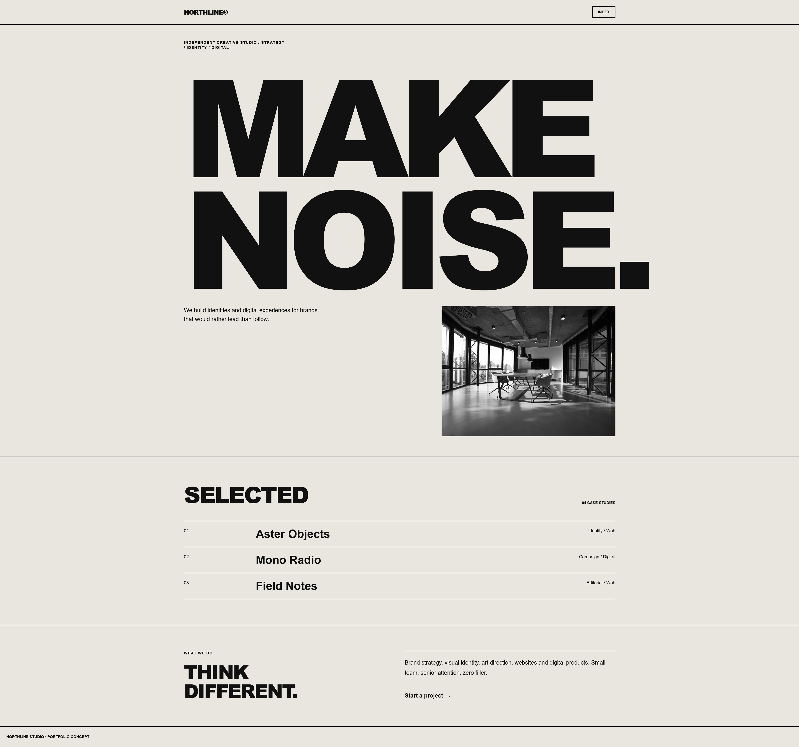
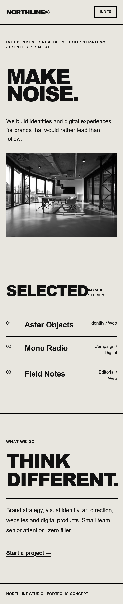

# Northline Studio — Creative Agency

A bold and editorial-style website concept for a modern creative studio.

## Preview

### Mobile Preview

## Live Demo

[View Live Demo](https://Bmax13.github.io/northline-creative-studio/)

## About the Project

Northline Studio is a creative agency website concept built around bold typography, strong visual hierarchy and an editorial-inspired layout.

The design focuses on presenting creative work in a distinctive and modern way while maintaining responsive behavior across different screen sizes.

## Features

* Bold editorial-style layout
* Responsive design
* Creative agency presentation
* Project showcase
* Large typography
* Services section
* Responsive navigation
* Mobile optimization
* Interactive elements

## Technologies

* HTML5
* Tailwind CSS
* JavaScript
* Responsive Design

## Purpose

This project was created as a frontend portfolio project to demonstrate the ability to translate creative visual concepts into responsive and functional websites.
